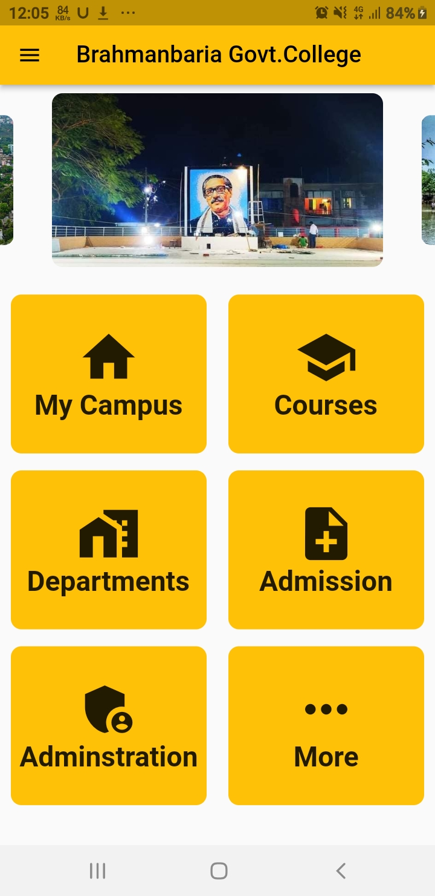
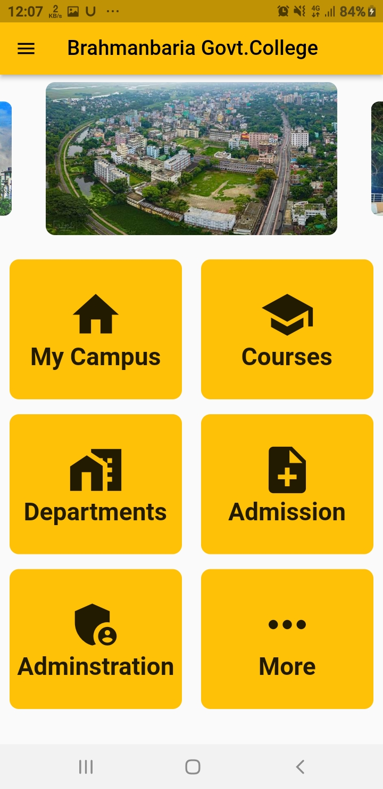
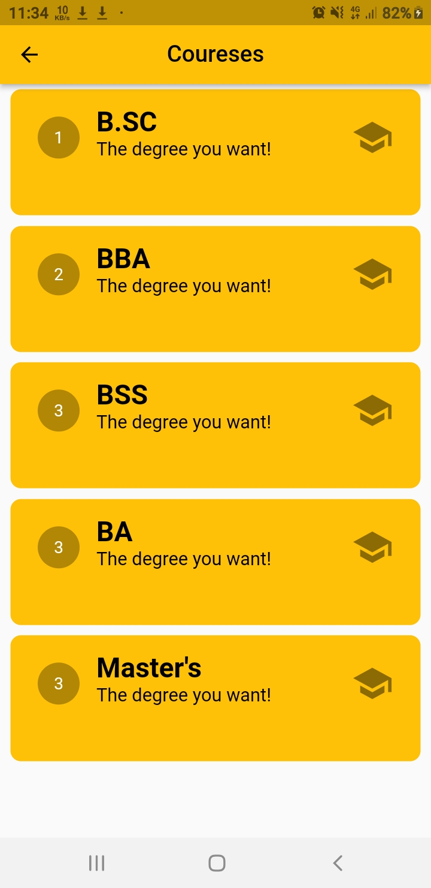
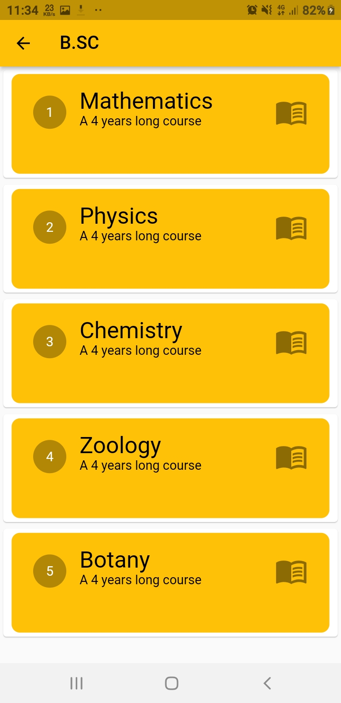
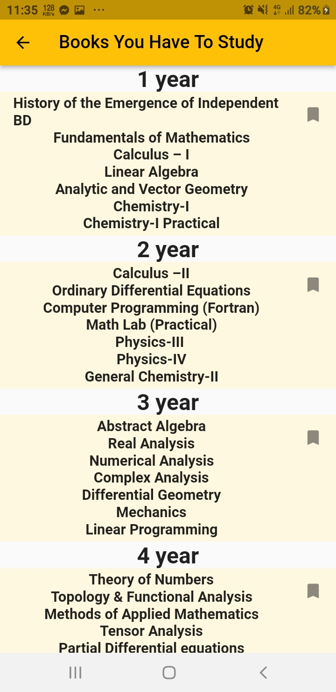
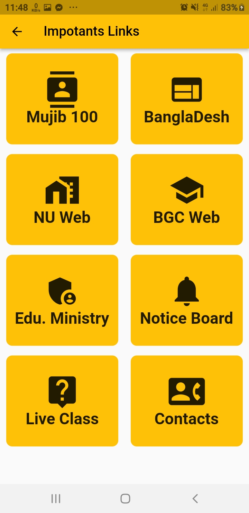
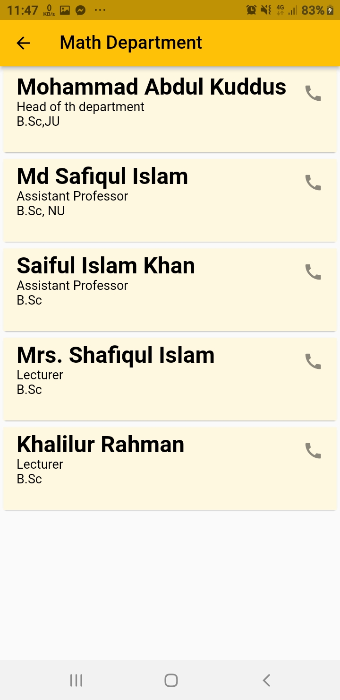
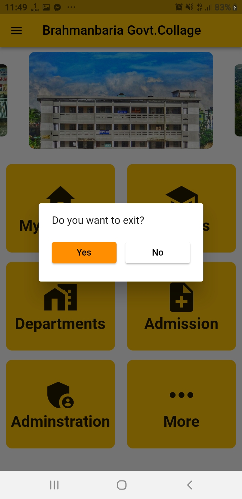

# BGC (Brahmanbria Govt. College)

This application is about Brahmanbaria Govt. College, a renown college in Banglasesh.

## Features

 - #My Campus: All information you want to know about Brahmanbaria Govt. College (BGC).
 - #Coureses: Find all info about HSC, Honors,Master's and other Degree of that college.
 - #Department: Find all department and teachers info here in one place.
 - #Admission: Road to get admitted BGC.
 - Clean & User Freindly Interface
 - You can launch your desired websites just in one click
 - There are organized & categorized tab you need
 - Explore of all educational websites and divisions under Education Ministry
 - and a bunch of usefull features.
 - Next updat are coming with a vere of features!

## Screenshots

       
<!-- 

assets/screenshots -->

## Try out BGC?

<<<<<<< HEAD
Android: [Download apk](https://drive.google.com/file/d/1LezTVTtj2i9Bv2u2g2YXMi025HNKGtSR/view?usp=sharing)
=======
Android: [Download](https://drive.google.com/drive/folders/1TXk2doYRpkpVVYC6oYfPT-Uxcpj9_E8v)
>>>>>>> 419533ef85fac440848304f1f6d64a3896e32e54

## Developer

Hi there! I am TAREQUL ISLAM. I create flutter's apps for solving problems and to make things easier. Try out my new app BGC (Brahmanbria Govt. College). If you have any query related to it don't hasitate to [e-mail me](mailto:tarequlislam542@yahoo.com). And also check out my other stuffs [here](https://github.com/tareqi542).

## Disclaimer

All rights reserved by Tarequl Islam. Copyright &copy; 2022.
 <small><i>This app contains logos or titles of BGC or it may contains photos of other individuals, collected from internet. These are the properties of their respective owners. BGC neither has any relation to these brands nor is associated with them. These assets are used for educational purposes only.</i></small>

### Note
 <small>BGC contains links of external websites inside it. Note that these external sites are not operated by us. Therefore, we strongly advise you to review the Privacy Policy of these websites. We have no control over and assume no responsibility for the content, privacy policies, or practices of any third-party sites or services.</small>
